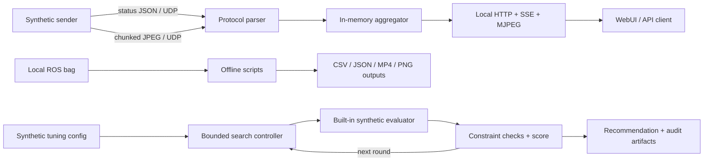

# Multi-UAV Field Toolkit

Public-safe, read-only tools for multi-UAV field-data review: a localhost UDP/WebUI
monitor with synthetic packets, offline ROS bag derivation scripts, and a bounded
simulation-only automatic parameter-tuning loop.

中文简介：面向多无人机外场实验的只读旁路监控、离线 ROS bag 处理和仿真自动调参
工具包。公开版只含合成演示数据，不含飞控、远程启停、真实网段、现场素材、真实调参
结果或原始实验数据。

> **Status:** public v0.1.0 under the MIT License. All bundled examples are synthetic;
> generated runs and field artifacts remain excluded.

The design is informed by a three-UAV high-altitude field workflow that processed more
than 100 GB of captured data. This repository is a clean allowlisted extraction; it does
not inherit the internal repository's Git history or operational configuration.

## What is included

- A dependency-light UDP status and chunked-JPEG protocol.
- An in-memory aggregator and localhost WebUI with JSON, SSE, image, and MJPEG endpoints.
- A bounded synthetic sender for a three-UAV demo without vehicles or ROS.
- Offline scripts to inspect bag topics, extract poses, export compressed-image previews,
  and build Livox occupancy grids.
- A bounded automatic tuning controller that proposes candidates, runs the bundled local
  synthetic evaluator, enforces metric constraints, and refines the next round without
  manual intervention.
- Three Codex skills that encode the safe monitor, data-processing, and synthetic-tuning
  workflows.
- Tests, cross-platform CI, architecture notes, and disclosure boundaries.

This project does **not** arm, launch, land, command, deploy to, or manage a UAV. It also
does not ship an adapter for live ROS topics in the first public release. The tuning
controller does not execute user-supplied commands, connect to ROS or a vehicle, or apply
its selected values to another system.

## Quick start: synthetic monitor

Prerequisites: [uv](https://docs.astral.sh/uv/) and Python 3.10 or newer.

```console
uv sync --all-extras --dev
uv run multi-uav-monitor --quiet
```

In a second terminal:

```console
uv run multi-uav-monitor-mock --duration-seconds 30
```

Open <http://127.0.0.1:8088> or inspect
<http://127.0.0.1:8088/api/snapshot>. The host binds to loopback by default. A remote bind
requires `--allow-remote` because the demo server has no authentication.

## Quick start: simulation-only automatic tuning

Validate the public synthetic experiment:

```console
uv run multi-uav-tune validate examples/synthetic/tuning/experiment.json
```

Preview the baseline without evaluating it:

```console
uv run multi-uav-tune run examples/synthetic/tuning/experiment.json --output-dir outputs/tuning-preview --dry-run
```

Run the full local loop:

```console
uv run multi-uav-tune run examples/synthetic/tuning/experiment.json --output-dir outputs/tuning-demo
```

Unlike a static parameter sweep, the controller closes the loop: each round evaluates a
bounded coordinate neighborhood, rejects constraint violations, and automatically refines
around the best historical candidate. This distills the reusable pattern used to adapt
planning modules across changing environments while omitting private field configurations,
measurements, and deployment code. See
[`docs/agent-in-loop-tuning.md`](docs/agent-in-loop-tuning.md).

## Offline bag workflow

Start by discovering topics. The scripts use PEP 723 metadata, so `uv run --script`
installs only the dependencies declared by that script.

```console
uv run --script scripts/inspect-bag-topics.py path/to/input.bag --include-all -o outputs/topics.csv
```

Then select one operation and pass topic names explicitly:

```console
uv run --script scripts/extract-pose-trajectory.py path/to/input.bag --pose-topic /chosen/pose -o outputs/trajectory.csv

uv run --script scripts/bag-images-to-video.py path/to/input.bag --topic /chosen/image/compressed -o outputs/video-preview

uv run --script scripts/livox-bag-to-occupancy-grid.py path/to/input.bag --lidar-topic /chosen/lidar --pose-topic /chosen/pose -o outputs/grids
```

The video script additionally requires `ffmpeg` on `PATH` or an explicit `--ffmpeg` path.
Outputs refuse replacement by default. CSV and JSON metadata record source basenames,
not absolute filesystem paths; derived imagery and trajectories can still be sensitive.

## Architecture



The monitor path is intentionally a read-only side channel. See
[`docs/architecture.md`](docs/architecture.md) and [`SECURITY.md`](SECURITY.md) before
adding any live integration.

## Codex skills

- `skills/multi-uav-monitor`: run and diagnose the localhost synthetic demo.
- `skills/process-uav-bag-data`: choose the smallest non-destructive offline bag operation.
- `skills/agent-in-loop-tuning`: run and review the bounded local synthetic tuning loop.

Review each `SKILL.md` before installing it. The skills deliberately exclude SSH,
vehicle control, remote process management, arbitrary evaluator commands, uploads,
destructive source-data actions, and live application of tuning results.

## Development

```console
uv sync --all-extras --dev
uv run ruff check .
uv run pytest
```

Repository guardrails for human and AI contributors live in [`AGENTS.md`](AGENTS.md).

## Publication checklist

- [x] Fresh repository with no inherited internal Git history.
- [x] Only allowlisted code; no real field data, network map, user path, or SSH tooling.
- [x] Localhost default, explicit remote-exposure gate, bounded packet assembly.
- [x] Output metadata path redaction and overwrite protection.
- [x] Tests and cross-platform CI.
- [x] Add the MIT License.
- [x] Add a synthetic-only automatic tuning loop with an allowlisted evaluator.
- [ ] Create a synthetic-only WebUI screenshot or short demo GIF.
- [x] Run a final secret/history scan immediately before the first push.

## License

This project is released under the [MIT License](LICENSE).
